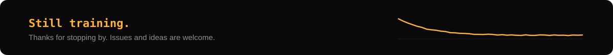

 

 

[Introduction](#introduction) · [Tech Stack](#tech-stack) · [Experience & Education](#experience--education) · [Achievements & Activities](#achievements--activities) · [Connect](#connect)

 

## Introduction

Hey there! 👋 I'm **Ravi Kumar Vishwakarma**, a passionate **AI & Data Science engineer** and B.Tech Computer Science student at AKS University, Satna, India.

I specialize in building intelligent, data-driven systems—from **Machine Learning and NLP pipelines** to **interactive Power BI dashboards** and **modern responsive web applications**. I am deeply interested in bridging the gap between raw data, artificial intelligence, and human-centric software solutions.

Beyond development, I actively share insights as a tech content creator (**@thequietengineer**), mentor peers as a **Microsoft Learn Student Ambassador**, contribute to open-source initiatives, and compete in national hackathons.

 

### At a Glance

| Parameter | Details |
|---|---|
| 🎓 **Education** | B.Tech in CSE (Specialization in AI & Data Science), AKS University (2025 – 2029) |
| 📍 **Location** | Satna, Madhya Pradesh, India |
| 💼 **Current Focus** | Machine Learning, Deep Learning, Predictive Modeling, Full-Stack Web Development |
| 🌐 **Community** | Microsoft Learn Student Ambassador, Tech Content Creator (@thequietengineer) |
| 🏆 **Hackathons** | Smart India Hackathon, HackerRank Orchestrate (Sep 2026), University Hackathons |
| 💡 **Interests** | Open Source, Cloud Technologies, Generative AI & NLP |

> [!NOTE]
> I am actively seeking internships, research collaborations, and project opportunities in AI, Data Science, and Software Engineering. Feel free to reach out!

 

---

## Tech Stack

<table>
  <tr>
    <td valign="top" width="50%">
      <b>Languages & Core</b>  
      
      
      
      
      
      
      
    </td>
    <td valign="top" width="50%">
      <b>AI, ML & Data Science</b>  
      
      
      
      
      
      
      
    </td>
  </tr>
  <tr>
    <td valign="top">
      <b>Web Development</b>  
      
      
      
      
      
      
    </td>
    <td valign="top">
      <b>Tools & Platforms</b>  
      
      
      
      
      
      
      
      
    </td>
  </tr>
</table>

 

---

## Experience & Education

### 💼 Experience

- **Data Analyst Intern** · *Future Interns* `(2026)`
  - Designed dynamic Power BI dashboards to track key KPIs, business performance, and customer segmentation.
  - Formulated advanced data modeling, data transformation pipelines, and statistical analysis using SQL and Python.
  - Translated complex datasets into actionable business narratives and executive presentations.

- **Data Analyst Intern** · *Cognifyz Technologies* `(Nov 2025 – Jan 2026)`
  - Performed exploratory data analysis (EDA), predictive trend analysis, and data validation on large datasets.
  - Automated routine reporting workflows through modular Python scripts and custom queries.
  - Conducted statistical evaluations to assist decision-making processes and model refinement.

### 🎓 Education

- **Bachelor of Technology (B.Tech) — Computer Science & Engineering**
  - *AKS University, Satna, MP* `(2025 – 2029)`
  - Specialization: **Artificial Intelligence & Data Science**
  - Coursework: Machine Learning, Deep Learning, Mathematics for Computing, Data Structures & Algorithms.

- **Higher Secondary Education (Class XII)**
  - *PMS GHSS Karhi* `(2023 – 2025)`
  - Major: Physics, Chemistry & Mathematics (PCM)

 

---

## Achievements & Activities

- 🚀 **Participant** — *Smart India Hackathon (SIH)*
- ⚡ **Participant** — *HackerRank Orchestrate* (Sep 2026)
- 💡 **Participant** — *University Innovation Hackathons*
- 🌐 **Microsoft Learn Student Ambassador** — Mentoring students in AI and cloud computing technologies.
- ✍️ **Tech Content Creator** — Publishing insightful technical blogs, code explanations, and tutorials (**@thequietengineer**).
- 🤝 **Open Source Contributor** — Active in collaborative repositories and developer communities.

 

---

## Connect

Let's discuss technology, collaborate on innovative projects, or explore professional opportunities:

 

---

## License

All rights reserved © Ravi Kumar Vishwakarma. Feel free to browse through the profile and connect!

 

